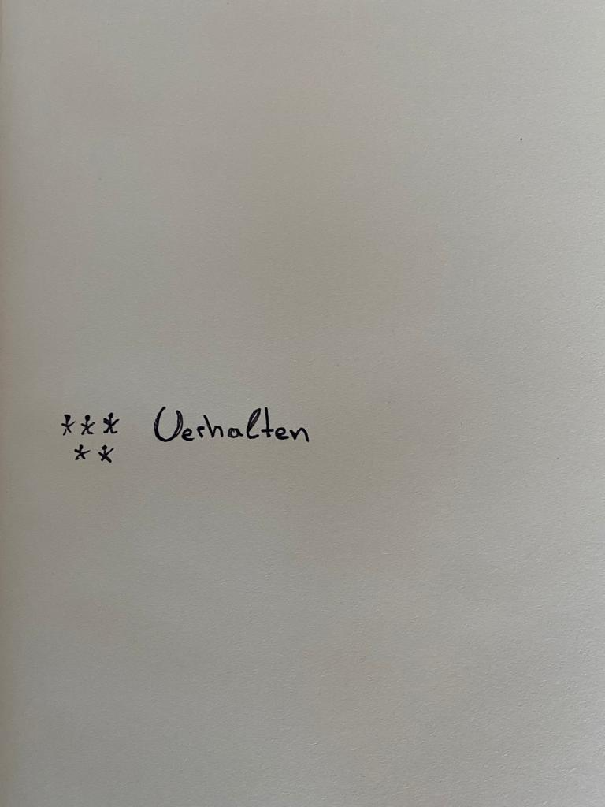

# Organizational Culture
-----
### What does organizations differentiate?
 
  

##### A presentation by Daniel König & Johannes von Fürstenberg

---

## Content

 1. What is organizational culture?
 2. How is culture created? 
 3. Importance of culture
 4. What are the types?
   freedom and responsibility -> Netflix, Marketing Agency 
    rules and process -> hospitals
 5. Examples for organizational culture (How to connect culture to a company)
    a. Google
    b. Netflix
    c. Zappos
    d. Twitter

   Focus on the learning content
   Interactively ask questions about ex. creativity vs. structure, error culture and no error culture.

---

## **Importance of culture**
-----

![Abbildung] to add

----

> "Culture is simply a shared way of doing something with a passion." - _Brian Chesky, Co-Founder, CEO, Airbnb_

----

<<<<<<< HEAD
## 1. What is organizational culture?
=======
> "Hire great people and give them freedom to be awesome." - _Andrew Mason, Founder, Groupon_

---
### Environment 

{
  "controls": true,
  "progress": true
}

---

### What is organizational culture?
>>>>>>> 54b1eee22fe40f8aa2456922408bd2f848591302

----

----

### Definition of organizational culture

<dl>
  <dt>Culture is a "system of rules and habits that guide how people live and behave together."

>
<dd> - Cecil Herman</dd>

---
### Components of a organizational culture:

- social system
- "rules":  
     -     values 
     -     norms 
     -     worldviews

 #### -> Behavior

---
Organizational culture is experienced internally, for example, by the fact that
- ... everyone works perceptibly towards a goal and everyone does what is necessary at their place to support their colleagues to the best of their ability.

Externals experience organizational culture, for example, in the fact that
- ...the customer is still cared after by a retailer with the same attention as before, even after the purchase of a product or service.

---

## 2. How is organizational culture created?

---

---

---

---

---

Abbildung5

---

### How is corporate culture built?

(Insert picture again)

----
### Creation of a organizational culture
| Management            | Result                       | 
| ----------------------|:--------------------------------:|
| Coaching employees    | mentoring, supporting and reflecting on results |
| Improvement-oriented environment | gaining experience independently |
| Setting an example of the desired culture | Management acts as a good role model |

----

Notes: What the exact content of coaching is, in what areas employees can drive change independently, and what values management exemplifies. Depends on various factors.
How important the corporate culture is and what types of corporate cultures there are, Johnny will tell you in the following

---

   ## Organizational Culture of Freedom and Responsibility

      - remove vacation policy
      - remove travel expense approvals
      - no decision-making approvals needed (or the keeper test)
      - lead with context, not control

---

#References
No Rules Rules: Netflix and the Culture of Reinvention, R. Hasting, E. Meyer (2020)
https://surveysparrow.com/blog/7-fabulous-organizational-culture-examples/

Organizational Culture - good source for the first overview
https://organisationsberatung.net/unternehmenskultur-kulturwandel-in-unternehmen-organisationen/
