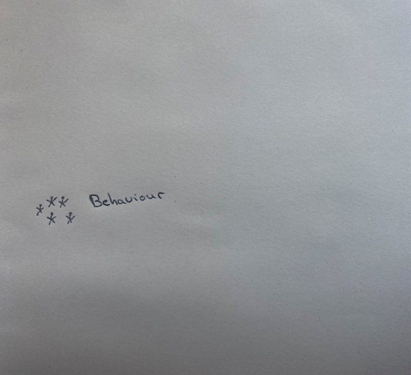
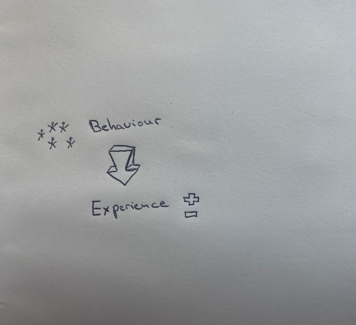
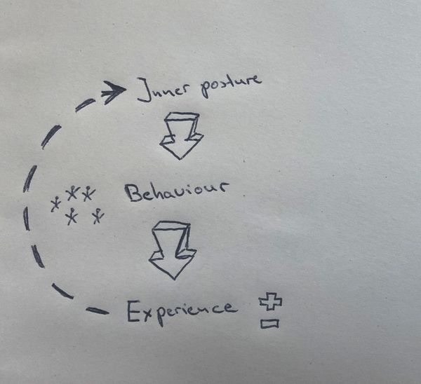
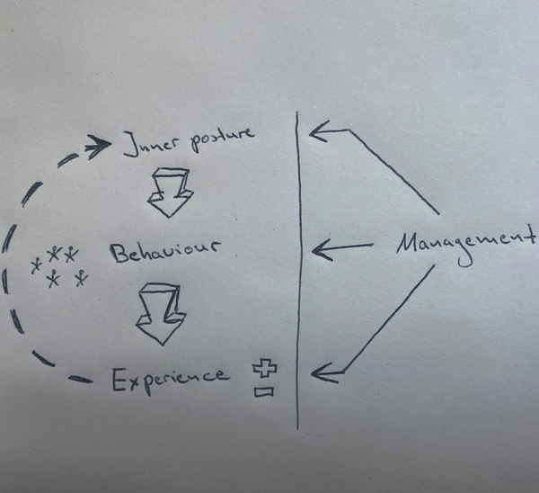
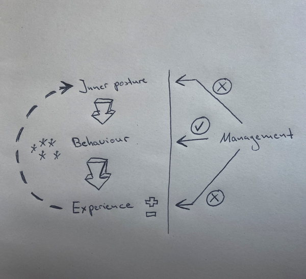
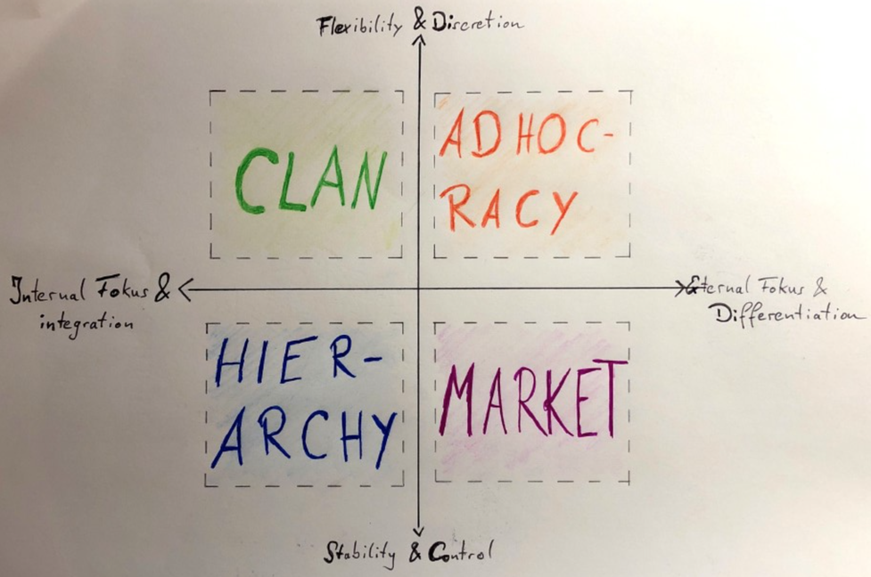
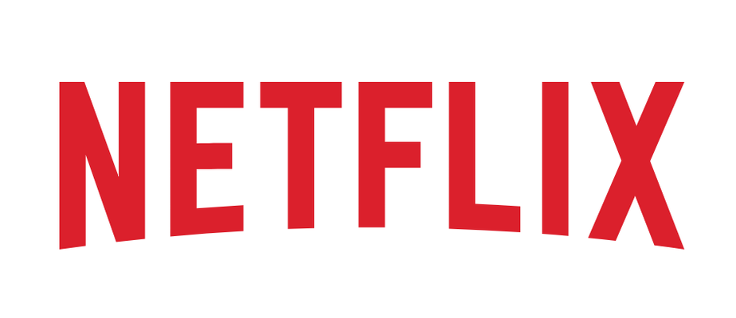

#  Organizational Culture
-----
#### What does organizations differentiate?
 
  

##### A presentation by 
Daniel König & Johannes von Fürstenberg

---

## Content

 1. Organizational culture
 2. How is culture created? 
 3. Importance of culture
 4. What are the types?
 5. Examples for organizational culture 
      * Netflix   
      * Google

---

## 1. Organizational culture
-----
'

### What is your current understanding of organizational culture? 

----

### Definition of organizational culture

<dl>
  <dt>Culture is a "system of rules and habits that guide how people live and behave together."

>
<dd> - Cecil Herman</dd>

----
### Components of a organizational culture:

- social system
- "rules":  
     -     values 
     -     norms 
     -     worldviews

 #### &rarr; Behaviour

----
<dl>

### Organizational culture is experienced...

 **internally**, by the fact that
- ... **everyone works perceptibly** towards a goal and everyone does what is necessary at their place to **support their colleagues** to the best of their ability.

**externally**, by the fact that
- ...the **customer** is still cared after by a retailer with the **same attention** as before, even after the purchase of a product or service.

---

## 2. Generation of organizational culture
-----

----

----

----

----

----

----
### Creation of a organizational culture
| Action                | | Result                       | 
| ----------------------| |--------------------------------|
| Coaching employees    | | mentoring, supporting and reflecting on results |
| Improvement-oriented environment | | gaining experience independently |
| Setting an example of the desired culture | | Management acts as a good role model |

---
## 3.  Types of organizational culture
-----

----
.jpg)
> **"Culture is simply a shared way of doing something with a passion."** - _Brian Chesky, Co-Founder, CEO, Airbnb_

----

.jpg)
> **"Hire great people and give them freedom to be awesome."** - _Andrew Mason, Founder, Groupon_

----
 ### Approaches 
-----

Charles Handy (1979)

Fons Trompenaars (1994)

Kim Cameron and Robert Quinn (1998)

----
### Culture types classification
___
| Handy                  | | Tropenaars                      | 
|:----------------------:| |:-----------------------------:  |
| Power culture          | |family culture                  |
| role culture           | |"Eiffel Tower" culture         |
| task culture           | |"Guided missile" culture        |
| People culture         | |Incubator culture               |

----
### Kim Cameron and Robert Quinn
-----

---

## **4. Importance of culture**
-----
- Importance: 
     -     Stability 
     -     Shared meaning 
     -     Patterning
     -     Dynamics

>> &rarr; All aspects of group life
---
## 5. Examples
-----

----

----
### Freedom & Responsibility
-----
   - remove vacation policy
   - remove travel expense approvals
   - keeper test
   - lead with context, not control

----

----
<dr>

**“Make sure everybody in the company has great opportunities, has a meaningful impact and is contributing to the good of society.”** — _Larry Page, CEO, Google_

-----
- Openness
- Innovation
- Excellence that comes with smartness
- Hands-on approach
- Small-company-family rapport  

---
## Survey

[Click to test your knowledge](https://2mwcwrygo5f.typeform.com/to/ZbJ12muX)

<button data-tf-popup="ZbJ12muX" style="all:unset;font-family:Helvetica,Arial,sans-serif;display:inline-block;max-width:100%;white-space:nowrap;overflow:hidden;text-overflow:ellipsis;background-color:#0445AF;color:#FFFFFF;font-size:30px;border-radius:35px;padding:0 44px;font-weight:bold;height:50px;cursor:pointer;line-height:50px;text-align:center;margin:0;text-decoration:none;">Are you ready?</button>
---

## References

###### Diagnosing and changing organizational culture, K. S. Cameron & R. E. Quinn (2011), 3rd Edition

###### No Rules Rules: Netflix and the Culture of Reinvention, R. Hasting, E. Meyer (2020)
###### https://surveysparrow.com/blog/7-fabulous-organizational-culture-examples/

###### https://organisationsberatung.net/unternehmenskultur-kulturwandel-in-unternehmen-organisationen/

 ###### http://www.doiserbia.nb.rs/img/doi/0013-3264/2013/0013-32641398035J.pdf

---
 # [Any questions?](QuestionMark22.gif)

---
